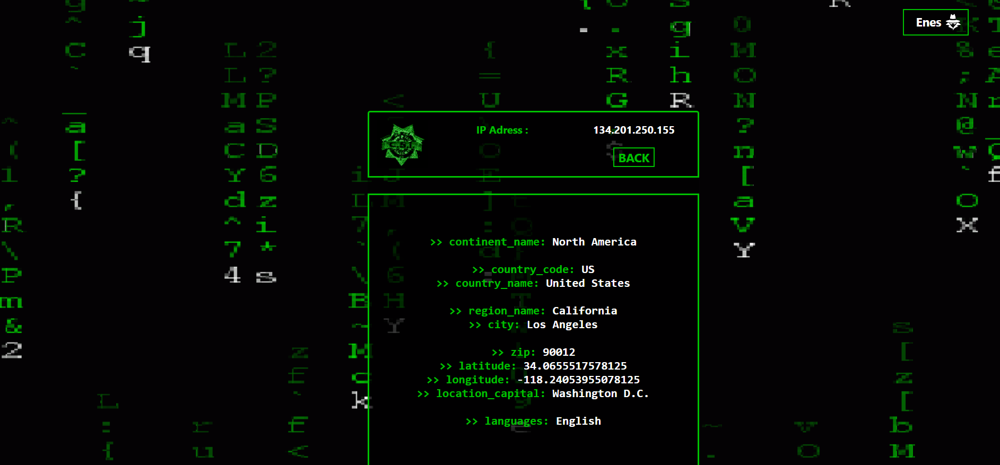
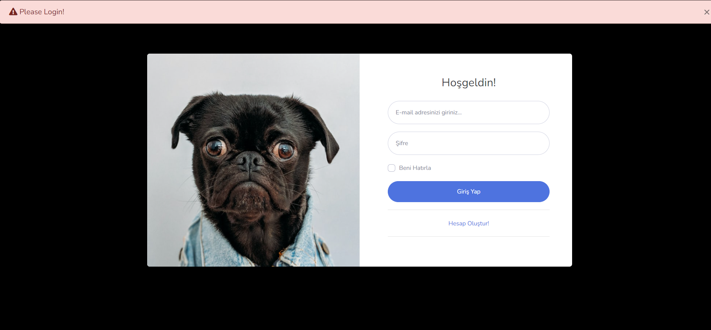
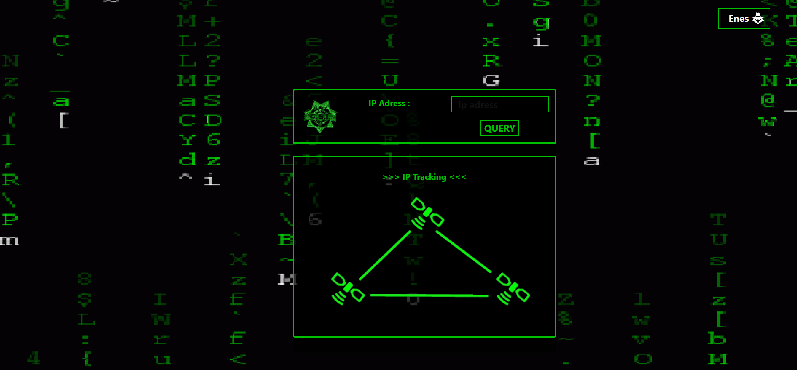
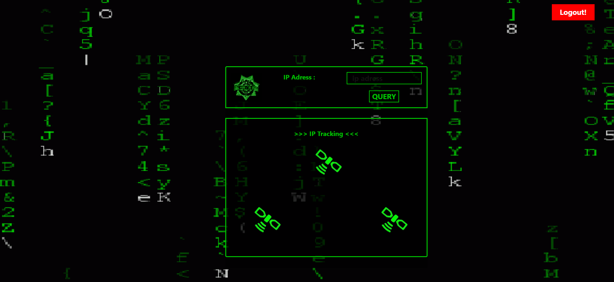
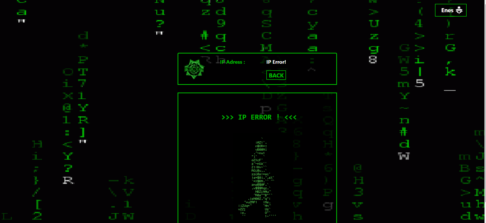
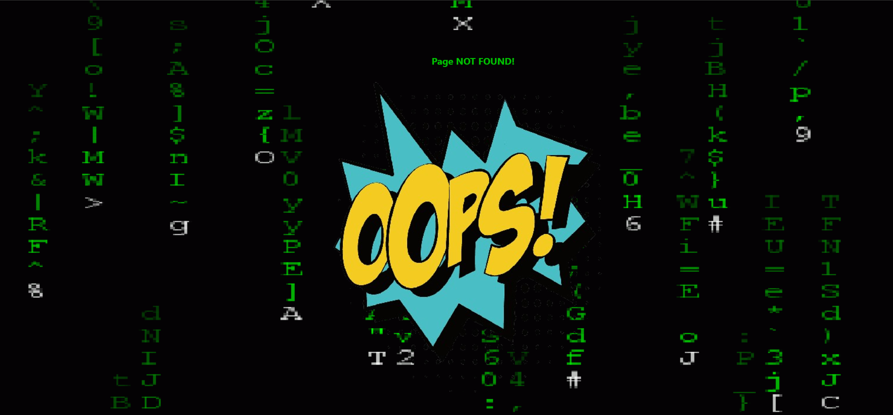

# ***IP SORGULAMA***

  

<b>-> Tüm IP bilgilerini sorgulayabilir ve o IP'lerin lokasyon bilgilerine erişebilirsiniz!.</b>
  

-> Bu proje NODEJS ile yapılmıştır!

-> Sorgulayacağınız IP bilgisini giriniz 
-> IP türünüz doğru ise sorgulama yapılacak ve IP lokasyon bilgileri gelecektir!

   

    

 
 
  

    <b><strong>Giriş ve kayıt işlemleri</strong></b>  
     
     
    <b><strong>IP SORGU SAYFASI</strong></b>  
      
      
    <b><strong>Hatalı IP girişi</strong></b>  
      
    <b><strong>Hatalı sayfa linki</strong></b>  
      

    

